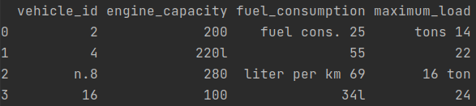
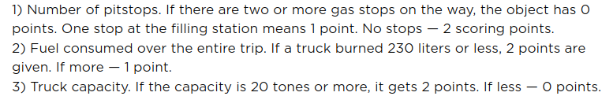

# Convoy Shipping Company
The Convoy Shipping company wants to create a single database that contains every company's vehicle to plan the logistics.
1. Prompt the user to give you a name for the input file (complete with the .xlsx, .csv, [CHECKED].csv or .s3db extension)
    1. if the file is a xlsx file convert it in csv file (taking the sheet named *Vehicles*)
    2. if the file is a csv file correct data right pre-processing the data (remove prefixes and suffixes)  
   Here is how the raw dirty data looks like:  
       
   3. Create a sqlite3 with table named *convoy* data base and insert the corrected and cleaned data
   4. Add a column named score storing the result of the scoring function.  
      Here is how the scoring function is defined
      
      It was found that the average route length is 450 km (the whole route).
      Remember that the *engine_capacity* is in liters, the *fuel_consumption* is in liters/100 kilometers, and the *maximum_load* is in tonnes.
   5. Generate a json file and a xml file with respect to the score: all entries with a score
   of greater than 3 should be exported to the *JSON* file, others to the *XML* file
